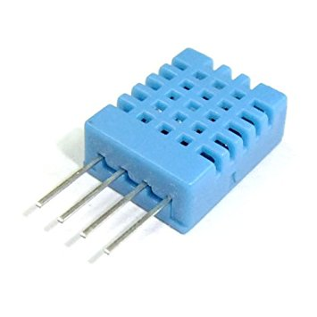
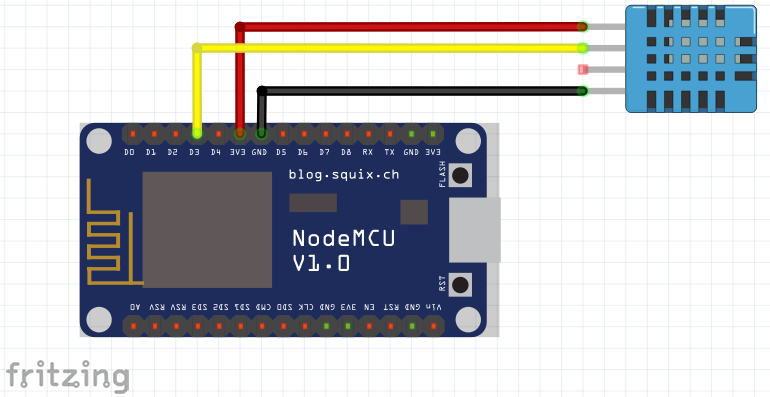

# DHT11
Sensor de humedad y temperatura DHT11

Este proyecto tiene por objetivo enviar datos mediante MQTT y webservice implementado sobre typo3.

Diagrama de Conección

## Hardware
  - nodemcu
  - DHT11
  - Cables Jumpers
  - Cable USB

## software
  - PlatformIO (IDE) (opcional) o ArduinoIDE
  - Librerias
    - Adafruit DHT unified
    - Adafruit unified sensor
    - PubSubClient: Utilizado para la coneccion con MQTT
  - board
    - nodemcu ESP8266
    - nodemcu comunity
    
